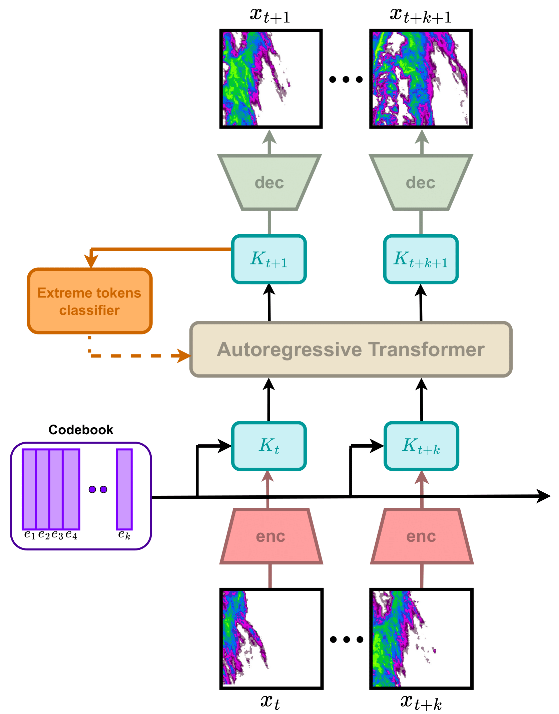
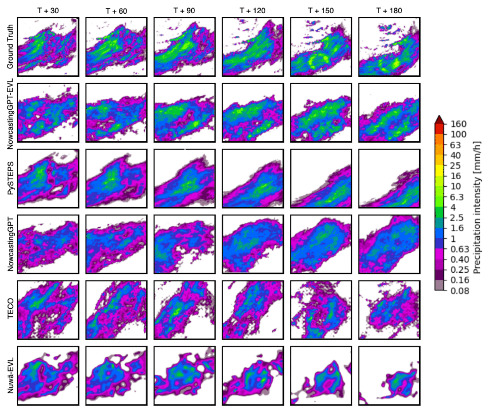

# NowcastingGPT: Extreme Precipitation Nowcasting using Transformer-based Generative Models

[<span style="color: red;">Spotlight Presentation</span>] Published as a workshop paper at ”Tackling Climate Change with Machine Learning”,
ICLR 2024
## Overview
This Github repository contains the code for the model NowcastingGPT-EVL which is a Transformer-based deep generative model for extreme precipitation nowcasting, specifically NowcastingGPT with Extreme Value Loss (EVL) regularization. Utilizing an extensive dataset from the Royal Netherlands Meteorological Institute (KNMI), our research aims to achieve accurate short-term precipitation predictions when compard with other benchmark weather prediction models. We propose an innovative approach to computing EVL that avoids the assumption of fixed extreme representations, overcoming the limitations of existing models in capturing extreme weather events. The link of the research paper is as follows https://arxiv.org/abs/2403.03929.

<div style="display: flex; justify-content: space-between;">
  
  	
</div>


## Table of Contents
- [Installation](#installation)
- [Getting Started](#getting-started)
- [Configuration](#configuration)
- [Dataset Availability](#Dataset-Availability)
- [Prediction of frames](#prediction)


## Installation

To set up the NowcastingGPT-EVL model on your system, follow these steps:

1. **Clone the Repository:**
   Use Git to clone the repository to your local machine. Open your terminal and run the following command:
   ```bash
   git clone https://github.com/cmeo97/NowcastingGPT.git

2. **Navigate to the Project Directory:**
   Change into the project directory using:
   ```bash
   cd NowcastingGPT-EVL

3. **Install Required Dependencies:**

   Create a virtual environment with python 3.8.16
 	``` bash
   conda create —name nowcasting python=3.8.16
   ```
   Activate it 
   ``` bash
	conda activate nowcasting
   ```   
   Now install the following (important to run separately to avoid error)-
	``` bash
      conda install pytorch=1.11.0
      conda install torchvision==0.12.0
      pip install torchaudio==0.11.0
      pip install torchmetrics==0.11.4
   ```
   
   Then install the other dependencies via
   ``` bash 
	   pip install -r requirements.txt
   ```
   and finally,
   ``` bash 
      pip install lightning-utilities==0.8.0    #(needs to be installed separately since it's a legacy version)
      pip install pycm
   ```
   For their specific case, but also for general instruction:
   If a warning appears stating that the current PyTorch installation is not compatible with the GPU sm_86 architecture, type:
   ``` bash
   TORCH_CUDA_ARCH_LIST="8.6"
   ```
   Then, reinstall PyTorch by running:
   ``` bash
   conda install pytorch=1.11.0
   ```
   
## Getting Started

   **To initiate a training run of the NowcastingGPT-EVL model, use the following command:**
   ```bash
   python src/main.py 
   ```
   **Logs and training metrics are synchronized with Weights & Biases by default**
   This feature can be disabled by setting the 'wandb mode: disabled' in the 'trainer.yaml' file.

   **To initiate a training run directly through Bash, use the following set of instructions:**
   ```shell
      chmod +x /______/_____/NowcastingGPT_new/trainer.sh
   ```
   The 'train.sh' file contains the path to Configuration File ('trainer.yaml') which controls all the parameters necessary for the training the different components of the model as well as evaluating it. Modifications here can adjust settings like learning rates, batch sizes, number of epochs and other hyper-parameters.
   
   The 'CONFIG_PATH' variable needs to be set to the path of the 'config' directory in your local machine.

   For only evaluating the model, the 'Evaluation' variable in the 'trainer.yaml' file needs to be set to 'TRUE'. The code to implement that has already been incorporated in the 'trainer.sh' file.

   Additionally, to run the training process remotely, nohup has also been incorporated in the script.

## Configuration (also mention the computational resources used)

Configuration of NowcastingGPT-EVL is managed through the YAML files located in the config/ directory. The config/tokenizer and config/world_model directories contain the YAML files for adjusting the model parameters of both the VQ-VAE as well as the Autoregressive Transformer. The parameters for the classifier can be adjusted in the src/models/world_model.py script.

## Dataset Availibility 

The dataset utilized for this project are radar images of the  "Archived 5-min rainfall accumulations from a radar dataset for the Netherlands". This dataset provides high-resolution rainfall data in the Netherlands region, which is crucial for refining and testing our model's predictive capabilities under various meteorological conditions. The radar images are collected based upon event times for different catchments and are mentioned in 'Dataset_CSV_Files' directory. These event times are calcuated based on the 3-hour precipitation average over the specified catchment regions. A detailed analysis of the event times can be found in this repository: [Nowcasting of Extreme Precipitation](https://github.com/bbbbihr/Nowcasting-of-extreme-precipitation). The selected images for the training, testing and validation datasets are then converted into NumPy arrays for an efficient training process. The scripts utilised for the above is src/Resize_Images.py.

The radar images used to create the subsequent datasets for training and testing the model is available here: [Archived 5-min rainfall accumulations for the Netherlands](https://data.4tu.nl/articles/dataset/Archived_5-min_rainfall_accumulations_from_a_radar_dataset_for_the_Netherlands/12675278)

## DataLoader

After the images have been converted into NumPy arrays using the 'Resize_Images.py' script, the 'collector.py' script has been utilised to create the specific dataloaders for the training, testing and validation datasets. 

The 'Collector' class has been constructed to load the numpy arrays. Parameters such as 'Batch Size' and 'Path to the different datasets (NumPy arrays)' can be set in the 'trainer.yaml' file.


## Prediction of frames 

For the prediction of frames the model can be run in its evaluation mode only or during training as well. To initiate this, the 'Evaluation' variable can be set to 'True' in 'train.sh' bash script. Moreover, the user can also change it in 'trainer.yaml' file. The parameters related to the prediction of frames such as observation time, lead time can be adjusted in 'src/make_prediction.py' script where it contains the 'generate' function. The frames get saved in the 'outputs/date/media/predictions' directory which gets created when the model is in its 'Evaluation' mode.

The reconstructed frames generated by the VQ-VAE (Tokeniser) are also saved in a similar fashion as the predicted frames in the outputs directory as 'outputs/date/media/reconstructions'. 

## Cite us! 

You can cite us using this bibtex:
 ```bash
@misc{meo2024extremeprecipitationnowcastingusing,
      title={Extreme Precipitation Nowcasting using Transformer-based Generative Models}, 
      author={Cristian Meo and Ankush Roy and Mircea Lică and Junzhe Yin and Zeineb Bou Che and Yanbo Wang and Ruben Imhoff and Remko         Uijlenhoet and Justin Dauwels},
      year={2024},
      eprint={2403.03929},
      archivePrefix={arXiv},
      primaryClass={cs.LG},
      url={https://arxiv.org/abs/2403.03929}, 
}
   ```

